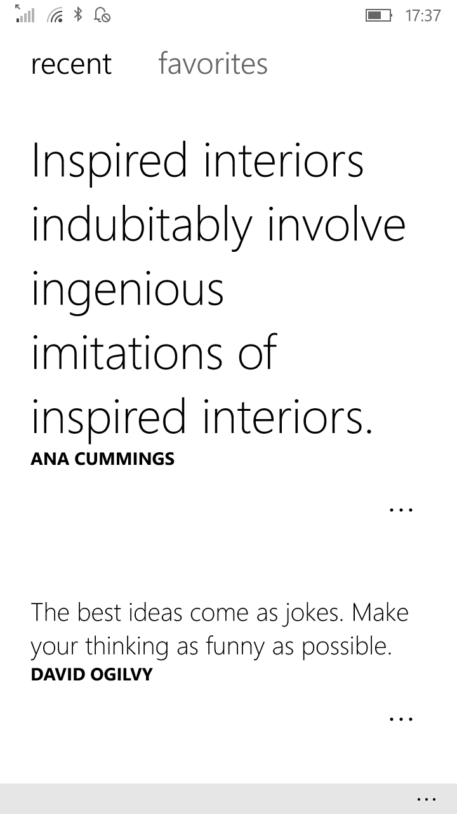
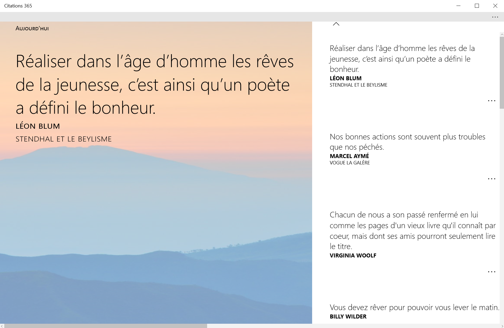
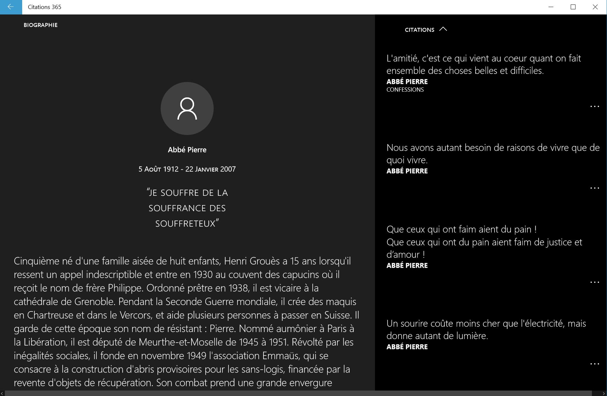

# Citations 365
A quotes app written for Windows 10.

Read meaningful quotes everyday.

# screenshots
## on mobile
### home

### lockscreen

## on desktop
### home

### author page

## tile animation

# features
* new quotes every day
* save the nicest quotes in your favorites
* share quotes to the world
* browse the database by famous authors (not available for all languages)

# setup
Steps to build and run this project:

1. Clone or download this repository
2. (Optional) Unzip the archive to your favorite location
3. Navigate to the _/Citations 365/_ folder
4. Open _'Citations 365.sln'_ in [Visual Studio](https://www.visualstudio.com/thank-you-downloading-visual-studio/?sku=Community&rel=15)
5. Choose your favorite platform and click on Run :)

# languages
This is app is only available in french for now

# platforms
* Windows Mobile 10
* Windows 10

# source

Quotes are from [Evene](http://evene.lefigaro.fr/)

# contributing

You can contribute to improve this project by:
* creating a pull request
* submitting new ideas / features suggestions 
* reporting a bug.

# todo

* Add english source
* Add option to apply generated images to wallpaper (currently only for locksreen)
* Adapt generated images for desktop devices (good looking only on mobile devices currently)
* Add a service to allow others apps to query quote data from _Citations 365_
* Add In-App-Purchases/Donation button