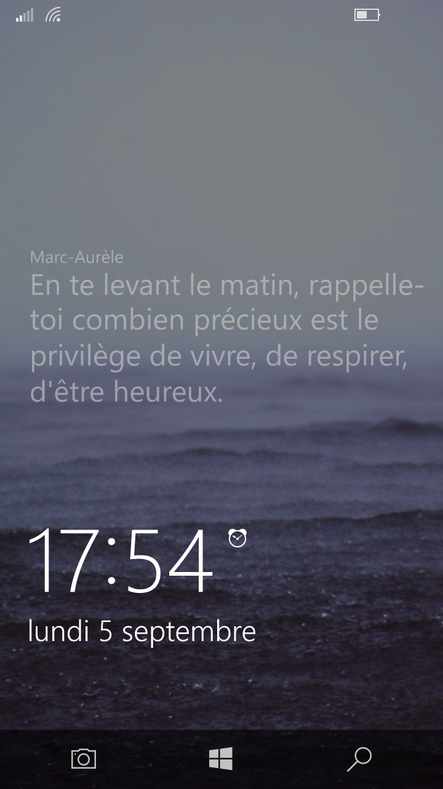
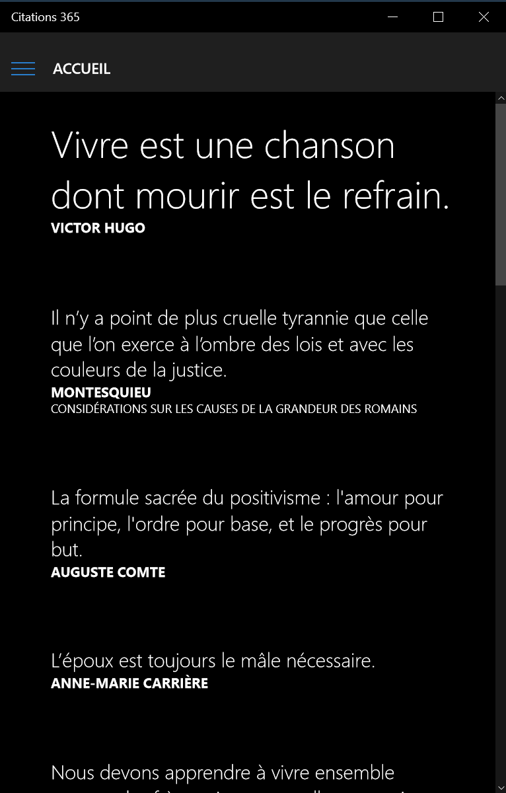
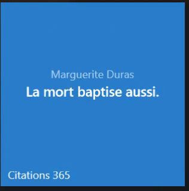

# Citations 365
A quotes app written for Windows 10.

Read a meanful quote everyday.

# screenshot

## tile animation

# features
* new quotes every day
* save the nicest quotes in your favorites
* share quotes to the world
* browse the database by famous authors

# language
This is app is only available in french (due to the unique source that I use)

# platforms
* Windows Mobile 10
* Windows 10

# librairies
* [SwipeableSplitView](https://github.com/JustinXinLiu/SwipeableSplitView)
* [LLMListView](https://github.com/brookshi/LLMListView)

## source

Quotes are from [Evene](http://evene.lefigaro.fr/)

## contributing

You can contribute to improve this project by creating a pull request, submitting new ideas, features suggestions or reporting a bug.