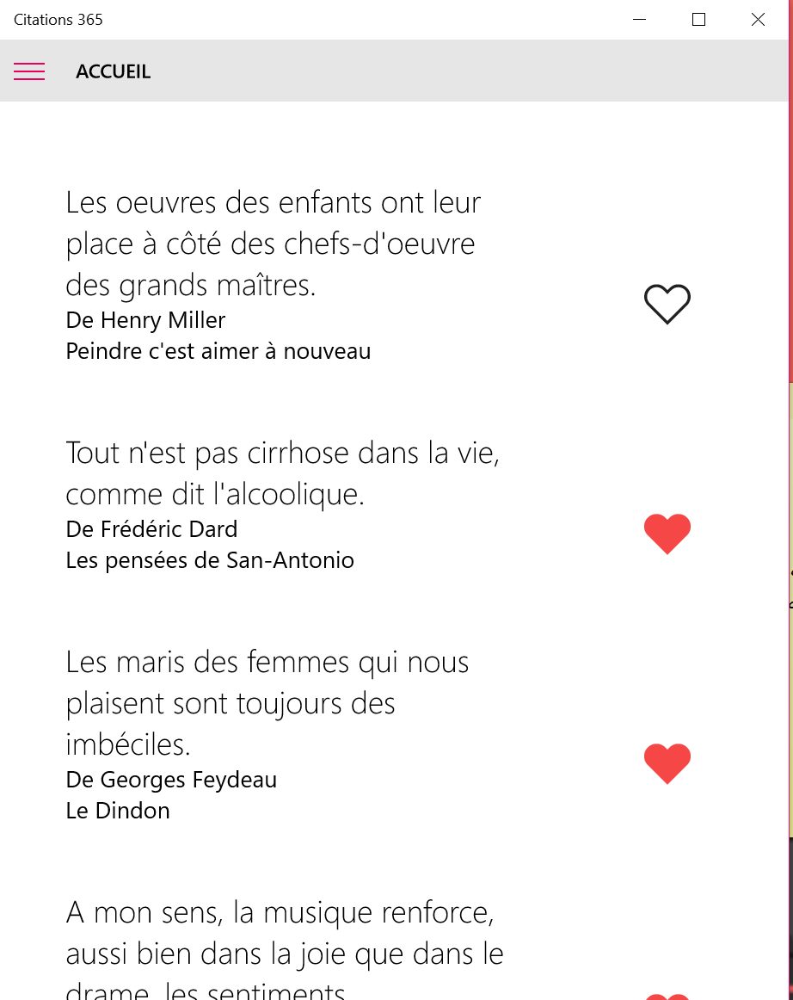

# citations365
A quotes app written for Windows 10

# screenshot

# features
* a new quote every day
* save the nicest quotes in your favorites
* share quotes to the world
* browse the database by famous authors

# language
This is app is only available in french (due to the unique source that I use)

# librairies
* [SwipeableSplitView](https://github.com/JustinXinLiu/SwipeableSplitView)
* [LLMListView](https://github.com/brookshi/LLMListView)
